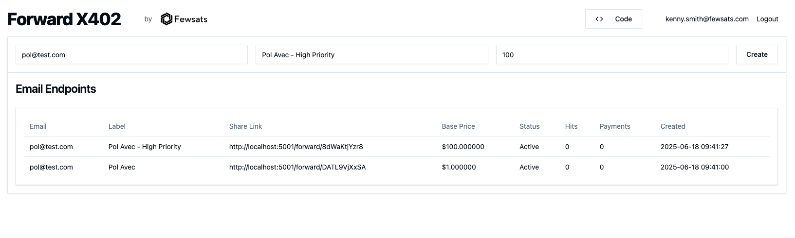
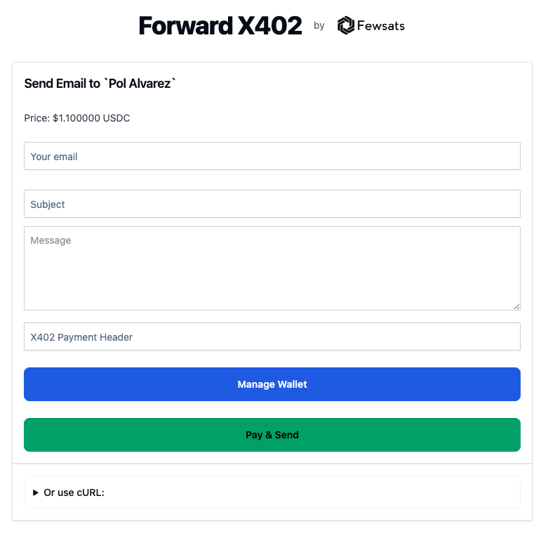

# Forward X402

A FastHTML-based email forwarding service using the X402 payment protocol. Users create paid email endpoints where others must pay in USDC to send emails to them.


- [Watch Demo](https://youtu.be/0gH736_gkDo)

You can create links with different labels (your email won't be shown to them ofc).



Users pay to send you an email either through the API or using the website & wallet connect.


All money is sent to the `X402_PAYMENT_ADDRESS` variable you set up in the `.env` file.

## Features

- **Paid Email Endpoints**: Create email addresses that require payment to send to
- **X402 Payment Protocol**: USDC payments via Coinbase CDP 

## Quick Start

```bash
# Install dependencies
pip install -r requirements.txt

# Start development server
just run
```

## How It Works

1. Create a paid email endpoint with custom pricing
2. Share the unique URL with others
3. Senders pay in USDC to deliver their message
4. Emails are forwarded to your actual inbox

Perfect for filtering high-signal communications by adding a small payment barrier.